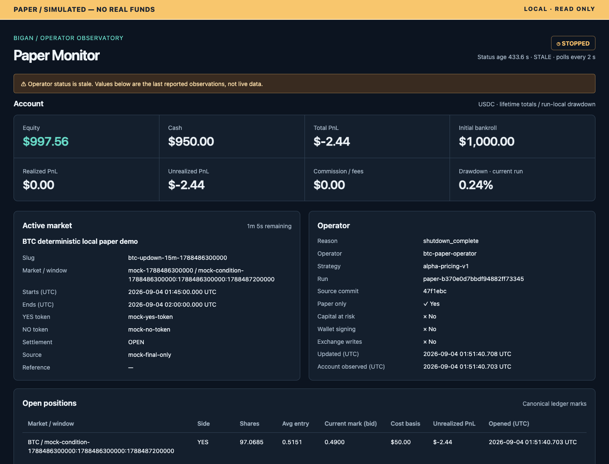
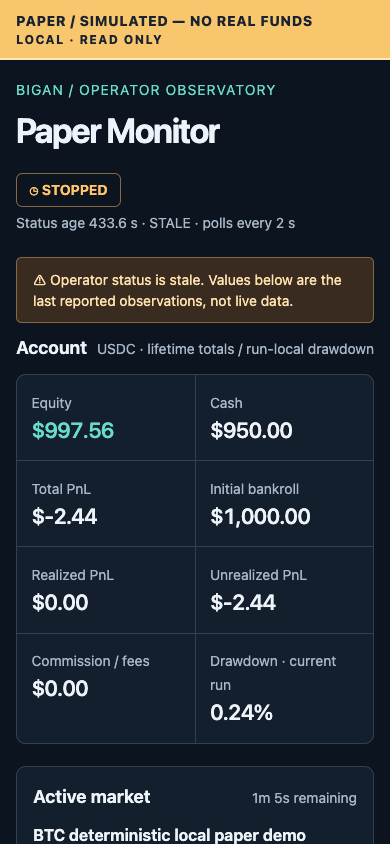

# Local paper trading dashboard (PR-C)

This is a **local, read-only, paper-only** monitor. It never starts or takes over
the operator/session, acquires a writer lock, connects a wallet, submits an
order, settles a market, edits configuration, or changes paper run files. There
is no authentication: **do not expose it through a public listener, proxy, port
forward, or tunnel**. Only literal loopback listeners are accepted.

## Start in two terminals

For one-command process lifecycle and soak reports, see
[the local paper stack](live_stack.md). The standalone commands below remain supported.

Install with `python -m pip install -e '.[dev]'` (or install the built wheel).
Run both commands from the same working directory with exactly the same TOML.
Relative `output_dir` paths retain the operator's existing working-directory
semantics; dashboard does not rewrite configuration or its hash.

Terminal 1, deterministic local data with no exchange requests:

```bash
python -m bigan.paper_trading.operator \
  --config config/paper_operator.example.toml --mock-demo
```

Terminal 2:

```bash
python -m bigan.paper_trading.dashboard \
  --config config/paper_operator.example.toml \
  --host 127.0.0.1 --port 8080
# Equivalent after installing the package:
# bigan-paper-dashboard --config config/paper_operator.example.toml
```

Open [http://127.0.0.1:8080](http://127.0.0.1:8080). If the port is occupied, use
another local port, such as `--port 8088`. SIGINT/SIGTERM stop only the dashboard.
The one-shot mock operator normally finishes in `STOPPED`; its status then ages
and the stale banner is expected. No fill is also a valid outcome, not an error.
For a live public-feed paper operator, use the
[verified-wheel setup](live_stack.md). A standalone dashboard given a live
configuration (`mock=false`, `dry_run=false`) also verifies its installed wheel
against `source_commit` before constructing the reader or opening the listener,
even without the Supervisor's hidden arguments. Source/editable installs remain
available for mock/config-inspection use, not verified live display. This
dashboard adds no live execution capability. A missing authoritative opening
reference still leaves that operator safely degraded.

## Architecture and read-only boundary

```text
Independent PaperTradingOperator writer
  atomic status + checkpoint + immutable run links + PR-A run files
                            ↓ reads only
DashboardReader (fresh frontier per request)
                            ↓
aiohttp GET/HEAD JSON API → packaged vanilla HTML / CSS / JavaScript
```

`PaperRunStore.open_read_only()` validates the existing manifest and returns a
read-only capability. It never calls `resume_existing()` or `recover_ledger()`.
Every mutation/recovery entry, including private append/index/atomic-write
helpers and create/resume on this capability, rejects before I/O. History
traversal in `OperatorReadRepository` opens predecessor stores read-only too.
No database/schema migration, event repair, truncation, recovery, or index
rebuilding is performed.

SQLite connections use URI `mode=ro`, `PRAGMA query_only=ON`, and a 20 ms busy
timeout. They do **not** use `immutable=1`, since the writer may still be active.
The canonical PR-A writer uses rollback journals. Unsupported/corrupt database
headers, WAL mode (which may need a writable shared-memory sidecar), or observed
SQLite journal/sidecar files make fills temporarily unavailable without opening
or repairing the index. Missing databases are never created. Normal file reads
can update OS-managed access times; the dashboard never calls touch/utime, and
tests assert file contents, sizes, modification/change times, and directory
membership are unchanged.

Each data request loads status and the config-hash-checked account checkpoint,
requires `ACTIVE`, compares its immutable run link, and validates manifest run,
window, symbol, opening cash, fee and source identities. The manifest's strategy
hash is validated as a hash, not regenerated by constructing a runner. It then
reads independent sections and rechecks status/run and checkpoint at the end.
Up to three consistency attempts are allowed, with a 250 ms retry budget and no
sleep; filesystem calls themselves cannot be preempted. If rollover prevents a
consistent view, status remains visible but account/history are `null` with a
warning. Nothing from two different active runs is combined. The next refresh
re-resolves the frontier; no startup checkpoint/run is cached.

This is not a cross-file transactional audit: status, account, and history
within the **same** run may reflect different event sequences while the writer
is appending. Account observation time/sequence are included. Replay validation
remains an operator responsibility; the dashboard must not try to repair it.

## API

| GET (also HEAD) | Meaning |
| --- | --- |
| `/` | Dashboard HTML |
| `/healthz` | Web process alive, independent of operator files |
| `/readyz` | 200 for readable, valid operator status; otherwise 503 |
| `/api/v1/dashboard` | One render: status, account, positions, recent runs/decisions/fills/settlements, warnings |
| `/api/v1/status` | Status plus age/stale metadata |
| `/api/v1/account` | Canonical account totals, positions and warnings |
| `/api/v1/runs` | Bounded newest-first run page |
| `/api/v1/decisions` | Bounded recent decisions, chronological within response |
| `/api/v1/fills` | Bounded recent FILLED decisions from the existing index |
| `/api/v1/settlements` | Bounded recent settlements |

The dashboard and four history routes accept `limit` and `before_run_id`.
`limit` defaults to `recent_query_default` (50), capped by `recent_query_max`
(500); zero, negatives, non-integers, duplicates and out-of-range values are 400.
Run cursors must match `paper-[0-9a-f]{24}` and are exclusive: exclude the named
run and query earlier predecessors. All unknown or repeated query keys are 400.
The remaining routes accept no query parameters. A syntactically valid but
unreadable/inconsistent cursor makes the affected sections unavailable.

History traversal and returned rows are bounded by existing read-model limits.
“Load older runs” replaces the current page; it does not accumulate history in
the browser. It pages **runs**, not every event in a large individual run. There
is no exact `has_more` claim. An empty bounded event page does not prove there
are no older events; use run pages to navigate further back.

Valid status yields 200 from the combined endpoint even when optional sections
fail; unavailable sections are `null` with sanitized `{code,message,section}`
warnings. Empty valid history is `[]`. Missing/unreadable status is 503, and an
unavailable standalone account/history endpoint is 503. `STARTING` and
`DISCOVERING` without a checkpoint remain displayable. Stale-but-valid status
is ready; readiness is not permission to trade.

PR-D adds safe `operator_identity` metadata (operator/strategy/account IDs,
source commit and the existing config hash) to the combined view. `/healthz`
also includes that identity and an optional stack launch `instance_id`; no
complete config, credential, filesystem path or operator status-schema change
is involved. Standalone callers may leave the launch ID unset.

POST/PUT/PATCH/DELETE/OPTIONS are rejected with 405. No CORS is enabled. The
server also validates local peers and Host values against loopback/localhost
to resist accidental exposure and DNS rebinding. All responses, including
errors and static assets, carry `no-store`, `nosniff`, `DENY`, `no-referrer`, and
a restrictive self-only CSP. APIs/errors use JSON; packaged HTML/CSS/JS use
their correct MIME types. Errors never include exception details, filesystem
paths, SQL, tracebacks, or configuration. The service has no outbound requests.

## What the page shows

- **Operator:** state/reason, operator/strategy/run IDs, source commit, explicit
  paper-only/write-disabled safety, update time, age, and stale status.
- **Market data (top of page):** fixed opening / price-to-beat reference and its
  metadata or public-endpoint proof; latest accepted Chainlink reference (explicit
  30s/60s published TWAP where applicable); Binance spot bid/ask midpoint; separate
  UP/YES and DOWN/NO best ask (buy) and bid (sell), each with available shares,
  token identity and event time. These observations come from the operator's
  bounded feed state, **not** from `last_decision` or position marks. No decision,
  Binance outage or insufficient volatility samples do not hide other sources.
  Each source has independent connection/age/freshness; unreconciled CLOB depth
  remains unavailable. Rollover clears the old observations. The additive
  `status.market_data` projection is optional when reading older status files;
  no fallback prices are fabricated. Opening proof is public JSON identity/hash
  binding, **not a signed oracle report**.
- **Account:** canonical lifetime initial bankroll, cash, equity, total/realized/
  unrealized PnL and fees. **Drawdown is the current run's canonical ledger
  drawdown**, not a newly computed lifetime statistic.
- **Active market:** title from the matching checkpoint, slug/window/tokens,
  countdown and the operator's settlement/source/reference observations.
- **Positions:** canonical shares, average entry, bid mark, cost and unrealized
  PnL; opened time is the earliest remaining lot for that window/side.
- **Feeds and alpha/pricing:** last-reported connection/synchronization/freshness,
  timestamps, ages, counters, OFI Z and available sample counts. Missing fields
  remain unavailable, never silently zero.
- **Latest decision inputs:** recorded Spot, oracle TWAP, TWAP weight and
  annualized volatility from `last_decision` only; historical decision inputs
  are deliberately separate from the current source observations above.
- **History:** decision signal/probability/edge/EV/size and execution/cash;
  fills with fee/order/signal-event identity; settlement payouts/proceeds/PnL;
  runs with opening cash, settled state and predecessor.

All times explicitly use UTC. Account and contract quotes use USDC (contract prices
are per share, before fees); Binance spot uses USDT and Chainlink/opening references
use USD. Missing prices render as an em dash, not zero. All external content is inserted
as text nodes, never executable HTML. The top banner always says
**PAPER / SIMULATED — NO REAL FUNDS**. States use text/symbols as well as color.
Tables scroll horizontally within responsive panels and support keyboard focus.

Polling occurs every two seconds after the preceding request completes (no
overlap). Failures retain the last successful render and show a warning. Status
is stale after `max(3 * status_interval_ms, 5000)` milliseconds; an ahead-of-reader
timestamp is also warned. Browser age/countdown continues between polls.
Individual quote ages also advance between polls. A failed refresh, stale status,
stopped operator or expired window prevents any quote from being labelled fresh.

## Troubleshooting

| Warning / symptom | Safe next step |
| --- | --- |
| Status unavailable / 503 | Verify the operator has published status and both processes use the same config, source commit and working directory. |
| No active run | Discovery/startup may not have created a run yet; inspect operator logs. |
| Frontier unavailable | Allow rollover to finish; otherwise check config hash, ACTIVE checkpoint, run link, manifest and missing run data through the operator recovery procedure. |
| Account unavailable | Inspect the account snapshot; never replace missing values with initial cash. |
| Recent fills unavailable | Check missing/corrupt/locked index or unsupported SQLite journal mode. Only the stopped operator's authorized recovery path may rebuild the index. |
| Decisions/settlements unavailable | An append may be incomplete; retry. Persistent malformed JSONL requires operator-side investigation, not dashboard repair. |
| Stale / STOPPED | The mock demo exits by design. For a long-running operator check its process and feed health. |

## Validation and screenshots

The automated suites cover malformed/missing artifacts, legal pre-run status,
all lifecycle states, three-attempt frontier failure, real operator rollover,
bounded cross-run queries, corrupt/locked/missing SQLite, atomic status replacement,
partial JSONL, security headers/methods/parameters and complete file-tree/hash/
write-timestamp invariance. Existing operator/session/agent-stack tests are retained.

An optional browser smoke script uses an externally installed Playwright, not
a package/runtime dependency or a build system:

```bash
node tests/paper_trading/dashboard/browser_smoke.cjs \
  http://127.0.0.1:8080 docs/paper_trading/images
# BROWSER_CHANNEL=chrome can use a locally installed Chrome.
```

Acceptance on 2026-09-04 used the two commands above with an isolated temporary
output directory and port 8088 (8080 was already occupied). The default mock
warm-up produced one decision/fill: cash 950.00, equity 997.56, and one open YES
position. The real mock ended STOPPED, hence the truthful stale banner in the
screenshots. Desktop/mobile rendering, keyboard operation, null displays,
literal rendering of an injected HTML title, and retention/recovery after
forced 503 responses passed. Automated rollover tests confirmed that the same
reader switches to the successor and can still query predecessor settlements.





Known limits: local POSIX operator storage only; no authentication, remote
access, writes, charts, live price stream, exact event pagination, recovery,
or new accounting algorithms. The existing operator status schema is unchanged.
